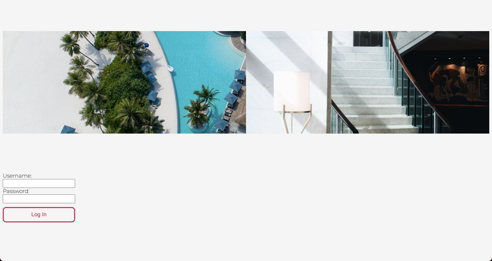

# Overlook Hotel

Overlook Hotel was originally a final project for Mod 2 of Turing School's Front-End program. The goal was to create a mock hotel booking site. Upon loading the site, the viewer would see a login page that prompts them for their username and password. For the time being, the default password is `overlook2021`, and the username is `customer<ID>`. The site uses that customer's ID in their username to fetch the corresponding data from a locally hosted API server and display any past bookings, the user's name, and their total amount spent. From there the user can view their info or create a new booking by selecting the date they'd like to make the booking for. They can filter by room type, and the site will display only the rooms available for the selected day (as well as by room type if it has been selected). Once they click the button to make a booking, the page will update to show their most recently made booking and will add the cost of that night's stay to their total spent.

## Languages & Technologies

* HTML (5)
* SCSS
* JavaScript (ES6)
* Fetch API
* Mocha & Chai
* Webpack
* DayJS

## Future Extensions

- [ ] Generally refactor and cut down on repetitive code
- [ ] Complete iteration 4; adding a `Manager` class that can create Bookings for other customers, delete Bookings, and add room service charges for customers
- [ ] Refactor to utilize a `Hotel` class that contains all of the Rooms and Bookings for that hotel, as well as a Manager
- [ ] Add more detailed info on available Rooms (possibly utilizing cards with images for each room, displaying room type, number of beds, whether they have a bidet, etc.)
- [ ] Clean up the 'Past Bookings' section; organize the dates from most recent to least recent, display in more easily readable format, etc.
- [ ] Clean up the UI design and make the site a better showcase of SCSS through mixins, animations, etc.
- [ ] Add more error handling and checks to site to avoid user error scenarios
- [ ] Allow user to book multiple-day stays

## Project Images

